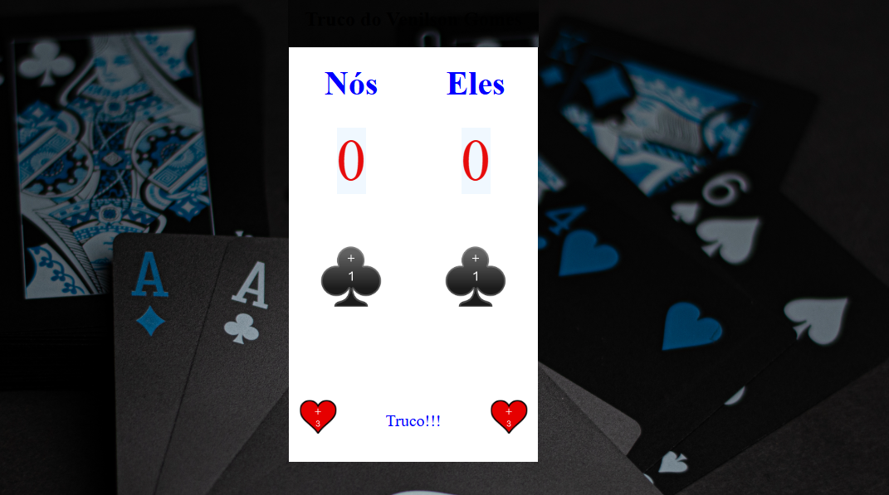
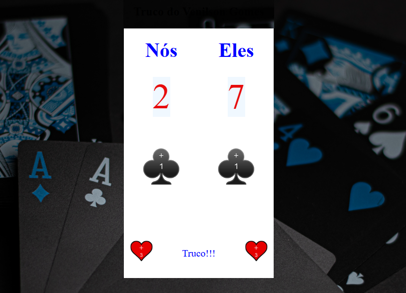
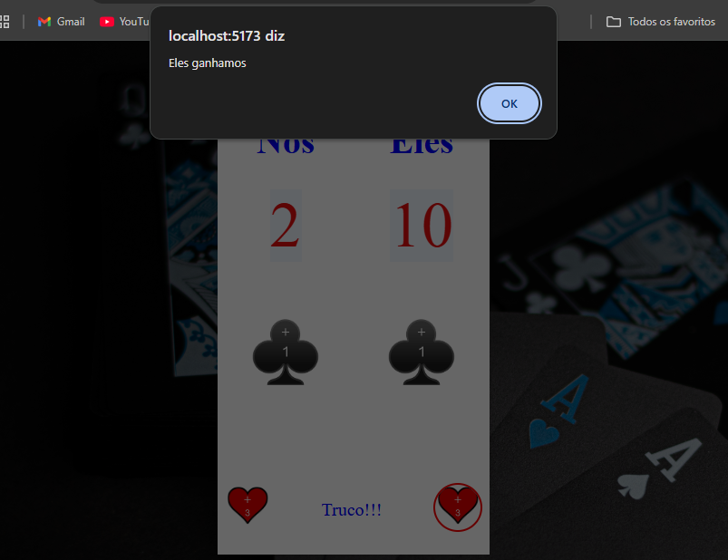

# Marcador-Truco
marcador de Pontos Truco

- 1 Ponto 
- 3 Pontos
- Ao atigir 11 ou Superior o Sistema dará uma mensagem que os jogo acabou e revelará os ganhadores
- Os pontos será Reiniciado

1 - Pontuação Inicial

2 - Ao Clicar em 1 ponto

3 - Ao clicar mais vezes

4 - A Comppletar 11 pontos ou mais 

